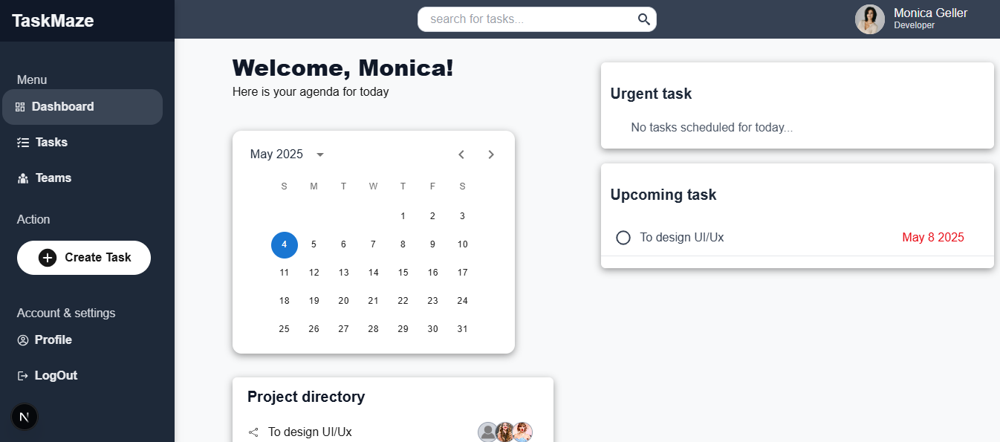

# Task Management System

A full-stack Task Management System built with **Node.js**, **Express**, **MongoDB**, and **React**. This application allows users to register, log in, and manage tasks efficiently.

## 🚀 Features

- User Registration and Authentication
- Role-based Access Control (Admin, User)
- Task Creation, Assignment, and Management
- Department-wise Team Management
- JWT-based Secure API Endpoints
- Responsive Frontend with React

## 📁 Directory Structure

```
task-management-system/
├── backend/
│   ├── config/
│   │   └── config.js
│   ├── models/
│   │   └── RegisterUser.js
│   ├── routes/
│   │   └── authRoute.js
│   ├── middleware/
│   │   └── verify.js
│   ├── index.js
│   └── package.json
├── frontend/
│   ├── public/
│   ├── src/
│   │   ├── components/
│   │   ├── pages/
│   │   ├── App.js
│   │   └── index.js
│   └── package.json
├── README.md
└── .gitignore
```

## 🛠️ Setup Instructions

### Prerequisites

- [Node.js](https://nodejs.org/) installed
- [MongoDB](https://www.mongodb.com/) installed and running

### Backend Setup

1. Navigate to the `backend` directory:

   ```bash
   cd backend
   ```

2. Install dependencies:

   ```bash
   npm install
   ```

3. Create a `.env` file and add your MongoDB URI and JWT secret:

   ```env
   MONGODB_URI=your_mongodb_uri
   JWT_SECRET=your_jwt_secret
   ```

4. Start the backend server:

   ```bash
   npm start
   ```

### Frontend Setup

1. Navigate to the `frontend` directory:

   ```bash
   cd frontend
   ```

2. Install dependencies:

   ```bash
   npm install
   ```

3. Start the frontend development server:

   ```bash
   npm start
   ```

The application will be accessible at `http://localhost:3000`.

## 📦 API Endpoints

### Authentication

- **Register User**
  - **URL:** `/api/auth/register`
  - **Method:** `POST`
  - **Body:**
    ```json
    {
      "fullName": "John Doe",
      "email": "john@example.com",
      "password": "password123",
      "role": "user",
      "department": "Development"
    }
    ```

- **Login User**
  - **URL:** `/api/auth/login`
  - **Method:** `POST`
  - **Body:**
    ```json
    {
      "email": "john@example.com",
      "password": "password123"
    }
    ```

- **Check Email Existence**
  - **URL:** `/api/auth/check-email`
  - **Method:** `POST`
  - **Body:**
    ```json
    {
      "email": "john@example.com"
    }
    ```

### User Management

- **Get User by ID**
  - **URL:** `/api/auth/user/:id`
  - **Method:** `GET`

- **Get All Teams**
  - **URL:** `/api/auth/getTeams`
  - **Method:** `GET`

*Note: Replace `:id` with the actual user ID.*

## 🔐 Authentication Middleware

The application uses JWT for securing API endpoints. The `verify.js` middleware checks for the presence of a valid token in the `Authorization` header.

## 📸 Screenshots

### 🏠 Dashboard

###  Task Section

###  Team Section

###  Create Task Section

###  Profile Section

###  Search Section


---

## 🤝 Contributing

Contributions are welcome! Please open an issue or submit a pull request for any improvements or bug fixes.

## 📄 License

This project is licensed under the [MIT License](LICENSE).
